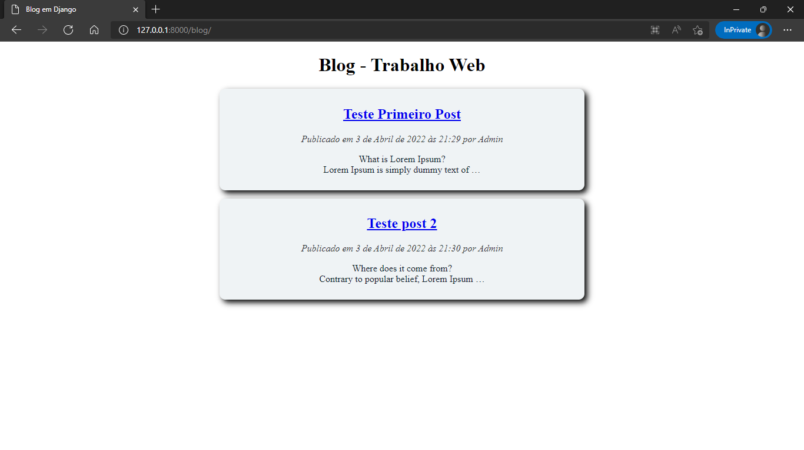

# **<p align = center> Trabalho web Django**

##  **Grupo: Guilherme Santos - João Paulo - Lorena Mendes**

---

## <p align = center>Versão da linguagem de programação deste projeto.

Para a criação deste projeto é necessário possuir o **Python 3.9** ou superior instalado no seu computador para instalar [click aqui](https://www.python.org/downloads/).

Também será necessário o editor de código **Visual Studio Code** que pode ser baixado  [clicando aqui](https://code.visualstudio.com/).

---

# <p align = center>**Criando um projeto com o Django**

Para utilizar o django no projeto iremos criar uma nova pasta que conterá o projeto e dentro desta pasta máquina virtual ``venv`` para o python.

---

## **Passo 1:** Criando uma máquina virtual ``python`` para o projeto.

### **O terminal usado foi o ``Windows PowerShell``.**

Dentro da nova pasta criada abra-a no terminal e execute o comando para criar uma máquina virtual venv.
*Observação: Neste exemplo o nome da pasta que será usado é **Projeto-Django**.*

```powershell
    python -m venv venv
```

**Exemplo:**

```powershell
   C:\Users\...\Projeto-Django > python -m venv venv
```
**Output:**

```powershell
    Looking in links: c:\Users\AppData\Local\Temp\tmpt90o0_4k
    Processing c:\users\appdata\local\temp\tmpt90o0_4k\setuptools-58.1.0-py3-none-any.whl
    Processing c:\users\appdata\local\temp\tmpt90o0_4k\pip-21.2.4-py3-none-any.whl
    Installing collected packages: setuptools, pip
    Successfully installed pip-21.2.4 setuptools-58.1.0
```
    
Após o comando dentro da pasta haverá criado uma nova pasta chamada **venv**.

```bash
    📦Projeto-Django
     ┗ 📁venv
```
Ativando a máquina virtual:
```powershell
    .\venv\bin\activate
```

*Output:*

```
   (venv) PS C:\Users\...\Projeto-Django > 
```

---

## **Passo 2:** Instalação do framework Django.

Instalando o Django para o projeto.

No terminal digite:

```powershell
    pip install django 
```

**Exemplo:**

```powershell
   (venv) PS C:\Users\...\Projeto-Django> pip install django
```

**Output:**

```powershell
    Collecting django
      Using cached Django-4.0.3-py3-none-any.whl (8.0 MB)
    Collecting sqlparse>=0.2.2
      Using cached sqlparse-0.4.2-py3-none-any.whl (42 kB)
    Collecting asgiref<4,>=3.4.1
      Using cached asgiref-3.5.0-py3-none-any.whl (22 kB)
    Collecting tzdata
      Using cached tzdata-2022.1-py2.py3-none-any.whl (339 kB)
    Installing collected packages: tzdata, sqlparse, asgiref, django
```

---

## **Passo 3:** Iniciando o Projeto Django.

 Para iniciar um projeto Django será necessário digitar no terminal o comando:
```powershell
    django-admin startproject nomeProjeto
```

**Exemplo:**

```powershell
   (venv) PS C:\Users\...\Projeto-Django> django-admin startproject meuBlog
```

**Output:**

Na pasta **Projeto-Django** será criado uma nova pasta com o nome indicado:
```bash
    📦Projeto-Django
     ┣ 📁 meuBlog
     ┗ 📁 venv
```

Abra o pasta meu Blog no Visual studio code:
Exemplo
```powershell
   (venv) PS C:\Users\...\Projeto-Django>  cd .\meuBlog\
   (venv) PS C:\Users\...\Projeto-Django\meuBlog> code .
```
Tela que aparecerá ao iniciar o Visual Studio code:


---

## **Passo 4:** Configurando o Python no Visual Studio code.

Aperte a tecla F1 do teclado e procure “Selecionar Interpretador” e clique nele.


Selecione o python da pasta venv do projeto e ative ele como interpretador.

---

## **Passo 5:** Testando se o projeto está ok.

No terminal verifique se está na pasta meuBlog, se sim digite o comando para executar o projeto:
```powershell
   python manage.py runserver
```

**Exemplo:**

```powershell
   (venv) PS C:\Users\...\Projeto-Django\meuBlog> python manage.py runserver
```
No terminal aparecerá o ip no qual está sendo executado exemplo: http://127.0.0.1:8000/
Ao clicar nesta tela será direcionado para a página inicial de um projeto django.


Na saída do terminal apareceu que:

<code style="color:red">
    You have 18 unapplied migration(s). Your project may not work properly until you apply the migrations for app(s): admin, auth, contenttypes, sessions.
    Run 'python manage.py migrate' to apply them.
</code>

No terminal  Aperte Ctrl + c para parar o servidor

---

## **Passo 6:** Migrando os apps padrões.

Para efetuar as migrações, no terminal digite o comando:

```powershell
  python manage.py migrate
```
**Exemplo:**

```powershell
  (venv) PS C:\Users\...\Projeto-Django\meuBlog>  python manage.py migrate
```
**Output:**
```powershell
  Operations to perform:
    Apply all migrations: admin, auth, contenttypes, sessions
  Running migrations:
    Applying contenttypes.0001_initial... OK
    Applying auth.0001_initial... OK
    Applying admin.0001_initial... OK
    Applying admin.0002_logentry_remove_auto_add... OK
    Applying admin.0003_logentry_add_action_flag_choices... OK
    Applying contenttypes.0002_remove_content_type_name... OK
    Applying auth.0002_alter_permission_name_max_length... OK
    Applying auth.0003_alter_user_email_max_length... OK
    Applying auth.0004_alter_user_username_opts... OK
    Applying auth.0005_alter_user_last_login_null... OK
    Applying auth.0006_require_contenttypes_0002... OK
    Applying auth.0007_alter_validators_add_error_messages... OK
    Applying auth.0008_alter_user_username_max_length... OK
    Applying auth.0009_alter_user_last_name_max_length... OK
    Applying auth.0010_alter_group_name_max_length... OK
    Applying auth.0011_update_proxy_permissions... OK
    Applying auth.0012_alter_user_first_name_max_length... OK
    Applying sessions.0001_initial... OK
```

---

## **Passo 7:** Criando um novo app.

Nesse passo vamos criar um novo app para o projeto chamado blog. Para isso no terminal vamos digitar o comando:

```powershell
   python manage.py startapp nomeApp
```

**Exemplo:**

```powershell
   (venv) PS C:\Users\...\Projeto-Django\meuBlog>  python manage.py startapp blog
```
Na pasta **meuBlog** será criado uma nova pasta com o nome indicado:
```bash
     📁 meuBlog
     ┗ 📁 blog
          ┣ 📁 migrations
          ┣ 📜 __init__.py
          ┣ 📜 admin.py
          ┣ 📜 app.py
          ┣ 📜 models.py
          ┣ 📜 tests.py
          ┗ 📜 views.py
```

---

## **Passo 8:** Criando um modelo de tabela para o banco de dados.
No visual studio code abra a pasta blog e abra para editar o arquivo **models.py**
Neste arquivo vamos criar uma classe Post, que definirá os campos da tabela que armazenará os posts no banco de dados. 
Digite o seguinte código para a criação desta classe:

```python
from django.db import models
from django.contrib.auth.models import User

# Create your models here.

class Post(models.Model):
    # Titulo do post.
    title = models.CharField(max_length=300)
    # Slug será a Url do post.
    slug = models.SlugField(max_length=300, unique=True, auto_created=title)
    # Autor do post.
    author = models.ForeignKey(User, on_delete=models.CASCADE)
    # Texto do post
    body = models.TextField()
    # Data de criação do post
    created = models.DateTimeField(auto_now_add=True)
    # Data de atualização do post.
    update = models.DateTimeField(auto_now=True)
```


Após ter adicionado essa classe vá na pasta **meuBlog/meuBlog** e selecione o arquivo settings.py
```bash
     📁 meuBlog
     ┣ 📁 blog
     ┗📁 meuBlog
          ┗ 📜 settings.py
```
Na linha 33 em **INSTALLED_APPS** adicione o blog: ‘blog.apps.BlogConfig’:
```python
INSTALLED_APPS = [
    'django.contrib.admin',
    'django.contrib.auth',
    'django.contrib.contenttypes',
    'django.contrib.sessions',
    'django.contrib.messages',
    'django.contrib.staticfiles',
    'blog.apps.BlogConfig', # Adicione o blog
]
```

Criando o arquivo de migrate, no terminal digite o comando:

```powershell
  python manage.py makemigrations blog
```
**Exemplo:**

```powershell
   (venv) PS C:\Users\...\Projeto-Django\meuBlog>  python manage.py makemigrations blog
```

**Output**

```powershell
Migrations for 'blog':
  blog\migrations\0001_initial.py
    - Create model Post
```

---


## **Passo 9:** Migrando o blog para o sql.

No terminal digite o comando para migrar o blog:

```powershell
   python manage.py sqlmigrate blog 0001
```

**Exemplo:**

```powershell
   (venv) PS C:\Users\...\Projeto-Django\meuBlog>  python manage.py sqlmigrate blog 0001
```

**Output**

```powershell
BEGIN;
--
-- Create model Post
--
CREATE TABLE "blog_post" ("slug" varchar(300) NOT NULL UNIQUE, "id" integer NOT NULL PRIMARY KEY AUTOINCREMENT, "title" varchar(300) NOT NULL, "body" text NOT NULL, "created" datetime NOT NULL, "update" datetime NOT NULL, "author_id" integer NOT NULL REFERENCES "auth_user" ("id") DEFERRABLE INITIALLY DEFERRED);
CREATE INDEX "blog_post_author_id_dd7a8485" ON "blog_post" ("author_id");
COMMIT;
```

Aplicando o migrate digite o comando:

```powershell
  python manage.py migrate blog
```

**Exemplo:**

```powershell
   (venv) PS C:\Users\...\Projeto-Django\meuBlog>  python manage.py migrate blog
```

**Output**

```powershell
Operations to perform:
  Apply all migrations: blog
Running migrations:
  Applying blog.0001_initial... OK
```

A tabela foi criada no banco de dados.

## **Passo 10:** Criando um usuário administrador.

No terminal digite este comando para criar um usuário administrador:


```powershell
  python manage.py createsuperuser
```

**Exemplo:**

```powershell
   (venv) PS C:\Users\...\Projeto-Django\meuBlog>  python manage.py createsuperuser
```
Será pedido o nome de usuário, senha e email, todos os campos devem ser preenchidos:

```powershell
Username (leave blank to use 'user'): Admin
Email address: Admin@email.com
Password:
Password (again):
Superuser created successfully.
```

Para testar esse usuário inicie o server usando o comando ``python manage.py runserver`` e acesse o endereço localhost/admin exemplo: http://127.0.0.1:8000/admin


Após logar verá a tela do administrador:


Para mudar o idioma da página, na linha 107 do ``settings.py`` mude o ``'en-us'`` para ``'pt-br'``, as páginas ficaram em portugues do brasil.

Na tela de administrador você poderá criar grupos e adicionar usuários ao banco de dados.

--- 

## **Passo 11:** Adicionado Post para alteração na tela de admin.


Vá ate o arquivo ``blog\admin.py`` nele escreva o seguinte código:

```python
from django.contrib import admin

from .models import Post

@admin.register(Post)
class PostAdmin(admin.ModelAdmin):
    list_display = ("title", "slug", "author", "created", "update")
    prepopulated_fields = {"slug":("title",)}

```
Dando F5 na página admin estará com uma nova opção para adicionar Posts:


Podendo adicionado novos posts com os campos definidos no **Passo 8**:


Adicione um método a ``class Post`` para definir o nome dos post adicionados igual ao título dos mesmos:

```python
def __str__(self):
        return self.title
```

—-

## **Passo 12:** Criando as Views.

Abra o arquivo blog\views.py nele vamos importar as classes ``DetailView`` e  ``ListView``, abaixo vamos importar nossa classe ``Post``.
Então criaremos duas classes que herdam  de ``DetailView`` e  ``ListView``, como no código abaixo:
```python
from django.views.generic import DetailView, ListView
from .models import Post

class PostListView(ListView):
    model = Post

class PostDetailView(DetailView):
    model = Post
```
Agora só temos que ligar está view a uma urls para isso vamos criar um arquivo ``.py`` dentro da pasta blog ficando ``meuBlog\blog\urls.py``.
Dentro deste arquivo será escrito o seguinte código:

```python
from django.urls import  path
from . import views

app_name = "blog"

urlpatterns = [
   # Link que será usado na tela inicial do blog.
    path("", views.PostListView.as_view(), name="list"),
   # Link usando os slugs de cada post, para vê-los.
    path("<slug:slug>/", views.PostDetailView.as_view(), name="detail"),
]
```
Agora vamos alterar o arquivo ``urls.py`` dentro da pasta ``meuBlog``, então temos que: ``meuBlog\urls.py``, o codigo deste arquivo ficará:
```python
from django.contrib import admin
from django.urls import path, include

urlpatterns = [
    path('admin/', admin.site.urls),
    path('blog/', include('blog.urls', namespace='blog')),
]
```

Agora será necessário criar os templates ``.html``.

---

## **Passo 13:** Criando os Templates.

Dentro da pasta blog vamos criar uma pasta ``template`` e dentro desta uma ``blog`` e dentro da blog ``post_list.html`` e um base.html, como abaixo:

```bash
  📁 meuBlog
  ┣ 📁 blog
  +  ┣ 📁 templates
     +  ┗📁 blog
          ┣ 📜 base.html
          ┗ 📜 post_list.html
```

No arquivo ``base.html`` vamos escrever o código:

```html
<!DOCTYPE html>
<head>
    <title></title>
</head>
<body>
    <header>
        <h1>Blog - Trabalho Web</h1>
    </header>
    <main>
        
        
    </main>
</body>
</html>
```
O arquivo ``post_list.html`` herdará a estrutura do ``base.html``, com o código abaixo::

```html


Blog em Django


    
        <article class="blockArtigo">
            <h2>{{ post.title }}</h2>
            <p class="date">
                Publicado em {{post.created}} por {{ post.author }}
            </p>
            {{ post.body|linebreaks|truncatewords:10 }}
        </article>
    

```

Criando o html que estará um post só, na mesma pasta criaremos  um arquivo ``post_detail.html`` com o seguinte conteúdo:

```bash
  📁 meuBlog
  ┣ 📁 blog
  +  ┣ 📁 templates
     +  ┗📁 blog
          ┣ 📜 base.html
          ┣ 📜 post_detail.html
          ┗ 📜 post_list.html
```

**post_detail.html:**

```html


Blog em Django - {{ post.title }}


    <article>
        <h2>{{ post.title }}</h2>
        <p class="date">
            Publicado em {{post.created}} por {{ post.author }}
        </p>
        {{ post.body|linebreaks}}
    </article>

```

--- 


## **Passo 14:** Adicionado o link ao clicar em um post.

No arquivo model será alterado a ``class Post``, vamos importar a classe reverse e adicionar um método a class, a class ficando assim:

```python
from django.db import models
from django.contrib.auth.models import User
from django.urls import reverse
# Create your models here.

class Post(models.Model):
    # Titulo do post.
    title = models.CharField(max_length=300)
    # Slug será a Url do post.
    slug = models.SlugField(max_length=300, unique=True, auto_created=title)
    # Autor do post.
    author = models.ForeignKey(User, on_delete=models.CASCADE)
    # Texto do post
    body = models.TextField()
    # Data de criação do post
    created = models.DateTimeField(auto_now_add=True)
    # Data de atualização do post.
    update = models.DateTimeField(auto_now=True)

    class meta: # Definindo a ordem do último post para o primeiro.
        ordering = ('-created',)

    def __str__(self):
        return self.title

    def get_absolute_url(self):
        return reverse('blog:detail', kwargs={'slug': self.slug})
```
Agora vamos mudar o arquivo ``post_list.html`` e adicionar um link para os posts completos:

```html


Blog em Django


    
        <article class="artigo">
            <h2>
                <a href="{{ post.get_absolute_url }}">
                    {{ post.title }}
                </a>
            </h2>
            <p class="date">
                Publicado em {{post.created}} por {{ post.author }}
            </p>
            {{ post.body | linebreaks | truncatewords:10 }}
        </article>
    

```

Com isso só iniciar o server e colocar /blog no link ficando: ``http://127.0.0.1:8000/blog`` e ao clicar aparecera está tela com os posts adicionados, para adicionar entre na tela de admin e adicione os posts:


e ao clicar no título é redirecionado ao post:


—

## **Passo 14:** Adicionado o css para as páginas.

No arquivo ``base.html`` vamos adicionar o link para um arquivo css, então vamos mudar o html para o seguinte:
```html


<!DOCTYPE html>
<head>
    <title></title>
    <link href="" rel="stylesheet">
</head>
<body>
    <header>
        <h1>Blog - Trabalho Web</h1>
    </header>
    <main>
        
        
    </main>
</body>
</html>

```

Após isso vamos criar uma pasta com o css na pasta ``meuBlog/blog``, será criado uma pasta static/css/blog.css

```bash
     📁 meuBlog
     ┣ 📁 blog
      +  ┣ 📁 templates
          ┣  📁 static
           +   ┗ 📁 css
                     ┗ 📜 blog.css
```

No ``blog.css`` será adicionado este código:
```css
body{
    margin-left: 3vw;
    margin-right: 3vw;
    text-align: center;
}

h1{
    text-align: center;
}

.artigo{
    margin-left: auto;
    margin-right: auto;
    margin-top: 2vh;
    margin-bottom: 2vh;
    min-width: 400px;
    max-width: 600px;
    width: auto;
    border-radius: 10px;
    padding: 10px;
    background-color: #eff3f5;
    box-shadow: 5px 5px 10px  black;
}

h2{
    font-weight: bold;
}
.date{
    font-style: italic;
    color: #303134;
}

article{
    margin-left: auto;
    margin-right: auto;
    min-width: 400px;
    width: 60%;
    color: #15262e;
}
```

# **Resultado do projeto:**

Para acessar os sites inicie  o servidor com o comando 
```powershell
    python manage.py runserver
```
**Output:**

```powershell
Watching for file changes with StatReloader
Performing system checks...

System check identified no issues (0 silenced).
April 04, 2022 - 15:07:36
Django version 4.0.3, using settings 'meuBlog.settings'
Starting development server at http://127.0.0.1:8000/
Quit the server with CTRL-BREAK.
```

## **No navegador acesse o blog com: http://127.0.0.1:8000/blog**
Nesta página conterá os posts que foram adicionados pelos usuários como por exemplo o ``admin``, exemplo com alguns posts adicionados:




---

E ao clicar no título de um post será redirecionado para a 
tela que mostra um post, no qual seu link é automático através do slug:


---